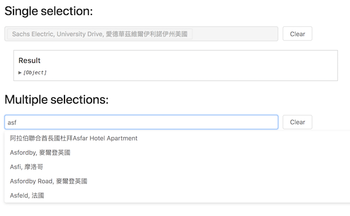

# antd-geosuggest [![NPM version][npm-image]][npm-url]  [![Dependency Status][daviddm-image]][daviddm-url]
> Antd based geo suggestion for Google maps places API
> Credits: This library and APIs are inspired by [react-geosuggest](https://github.com/ubilabs/react-geosuggest)



## Installation

```sh
$ npm install --save antd-geosuggest
```

## Prerequisite

As this component uses the Google Maps Places API to get suggests, you must include the Google Maps Places API in the `<head>` of your HTML:

```html
<!DOCTYPE html>
  <html>
  <head>
    …
    <script src="https://maps.googleapis.com/maps/api/js?key=YOUR_API_KEY_HERE&libraries=places"></script>
  </head>
  <body>
    …
  </body>
</html>
```

Visit the [Google Developer Console](https://console.developers.google.com) to generate your API key. The API's that you have to enable in your Google API Manager Dashboard are [Google Maps Geocoding API](https://developers.google.com/maps/documentation/geocoding/start), [Google Places API Web Service](https://developers.google.com/places/web-service/) and [Google Maps Javascript API](https://developers.google.com/maps/documentation/javascript/).

## Usage

```js
import GeoSuggest from 'atnd-geosuggest';

// Single selection 
<GeoSuggest onChange={(result) => this.updateData(result)}/>

// Multiple selection 
<GeoSuggest multiple onChange={(result) => this.updateData(result)}/>

```

### Properties

#### placeholder
Type: `String`
Default: `Search places`

The input field will get this placeholder text.

#### location
Type: [`google.maps.LatLng`](https://developers.google.com/maps/documentation/javascript/reference#LatLng)
Default: `null`

To get localized suggestions, define a location to bias the suggests.

#### radius
Type: `Number`
Default: `0`

The radius in meters defines the area around the location to use for biasing the suggests. It must be accompanied by a `location` parameter.

#### bounds
Type: [`LatLngBounds`](https://developers.google.com/maps/documentation/javascript/reference?csw=1#LatLngBounds)
Default: `null`

The bounds to use for biasing the suggests. If this is set, `location` and `radius` are ignored.

#### types
Type: `Array`
Default: `null`

The types of predictions to be returned. Four types are supported: `establishment` for businesses, `geocode` for addresses, `(regions)` for administrative regions and `(cities)` for localities. If nothing is specified, all types are returned. Consult the Google Docs for [up to date types](https://developers.google.com/maps/documentation/javascript/reference#AutocompletionRequest).

#### minLength
Type: `Number`
Default: `1`

Sets a minimum length of characters before a request will be sent to find suggestions.

#### onChange
Type: `Function`
Default: `function(suggest) {}`

Gets triggered when a suggest got selected. Only parameter is an object with data of the selected suggest. This data is available:

* `placeId` – Type `String` – If it is a preset, equals the `label`. Else it is the Google Maps `placeID`
* `location` – Type `Object` – The location containing `lat` and `lng`
* `gmaps` – Type `Object` – *Optional!* The complete response when there was a Google Maps geocode necessary (e.g. no location provided for presets). [Check the Google Maps Reference](https://developers.google.com/maps/documentation/javascript/reference#GeocoderResult) for more information on it’s structure.


## Start example server

```
npm start
```

## generate demo

```js
npm run gh-pages
```

## License

MIT © [chilijung]()


[npm-image]: https://badge.fury.io/js/antd-geosuggest.svg
[npm-url]: https://npmjs.org/package/antd-geosuggest
[travis-image]: https://travis-ci.org/chilijung/antd-geosuggest.svg?branch=master
[travis-url]: https://travis-ci.org/chilijung/antd-geosuggest
[daviddm-image]: https://david-dm.org/chilijung/antd-geosuggest.svg?theme=shields.io
[daviddm-url]: https://david-dm.org/chilijung/antd-geosuggest

<a href="https://canner.io">
  
</a>
